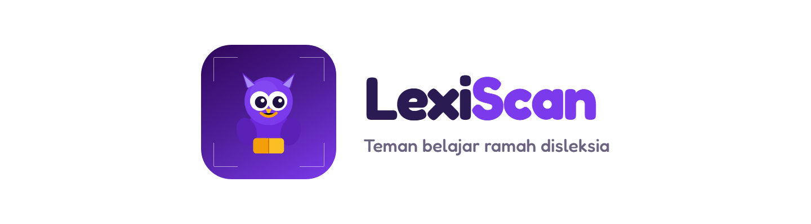

<p align="center">
  <picture>
    <source media="(prefers-color-scheme: dark)" srcset="./assets/brand/lexiscan-lockup-dark.png" />
    
  </picture>
</p>

<p align="center">
  <strong>Aksesibilitas Membaca untuk Disleksia - OCR Cerdas + AI Text Simplification</strong>
  <br />
  <em>GEMASTIK XIX 2026 - Kategori VIII (Pengembangan Perangkat Lunak)</em>
</p>

<p align="center">
  
  
  
  
  
  
  
  
  
  
  
  
</p>

---

## 📖 Ikhtisar

**LexiScan** adalah aplikasi *mobile* inovatif yang dirancang sebagai "lensa aksesibilitas" untuk menjembatani kesenjangan pendidikan bagi penyandang disleksia. Melalui pendekatan ganda **Visual** dan **Kognitif**, LexiScan tidak hanya memperbaiki tampilan teks agar mudah dibaca (*Adaptive Typography*), tetapi juga menyederhanakan kalimat akademis yang kompleks tanpa menghilangkan makna aslinya (*AI Text Simplification*).

---

## ✨ Fitur Utama

| # | Fitur | Deskripsi |
|---|-------|-----------|
| 1 | 📸 **Smart OCR Scan** | Foto dokumen fisik → teks digital instan menggunakan *Google ML Kit* (OCR on-device). Dilengkapi koreksi typo berbasis AI. |
| 2 | 🔤 **Adaptive Typography Engine** | Restrukturisasi tipografi otomatis: font Atkinson Hyperlegible, spasi baris, ukuran huruf, **pemenggalan suku kata** ("Mi-to-kon-dri-a"), serta mode **Bicolor Words** & **Reading Ruler**. |
| 3 | 🧠 **AI Text Simplification** | Lima tingkat, dengan nama yang sama seperti di aplikasi: **Teks Asli → Sedikit Lebih Mudah → Bahasa Santai → Poin Singkat → Paling Mudah**. Dari teks sesuai sumber sampai kalimat sangat pendek dengan kata sehari-hari, memakai *Large Language Model* tanpa mengubah fakta. Tingkat Teks Asli tidak memanggil AI sama sekali. |
| 4 | 🎯 **Focus Reading Mode** | Sorot satu paragraf aktif dan redupkan sisanya. Dilengkapi navigasi antar paragraf & *Reading Ruler* untuk menjaga konsentrasi baca. |
| 5 | 💡 **AI Explain This** | Pilih teks/kalimat yang sulit → Lexi jelaskan dengan 3 gaya: bahasa paling sederhana, analogi, atau contoh nyata. Panjang jawabannya menyesuaikan kemampuan membaca pengguna. |
| 6 | 🔊 **Text-to-Speech** | Setiap paragraf, jawaban Lexi, dan suku kata bisa dibacakan. Memakai mesin TTS bawaan perangkat lewat `expo-speech` - gratis tanpa batas, jalan offline, dan **tidak memakai kuota LLM**. Suara dan kecepatannya bisa dipilih sendiri di Pengaturan, dan nama tiap tombol ikut dibacakan bagi yang belum bisa membaca. |
| 7 | 👤 **Profil Kemampuan Membaca & Jenjang** | Dipilih saat mendaftar (didampingi guru atau orang tua). Tipografi, pemenggalan suku kata, suara, dan panjang jawaban AI menyesuaikan sendiri - dan semuanya tetap bisa dimatikan manual. |

---

## 🏗️ Arsitektur Sistem

```
┌──────────────────────────────────────────────────────────────┐
│                    MOBILE APP (Expo)                          │
│  ┌──────────┐  ┌──────────┐  ┌──────────┐  ┌──────────────┐ │
│  │  Camera  │  │  ML Kit  │  │  Reader  │  │  Settings    │ │
│  │  (Scanner)│  │  (OCR)   │  │  (Baca)  │  │  (Tipografi)│ │
│  └────┬─────┘  └──────────┘  └────┬─────┘  └──────────────┘ │
│       │                            │                          │
│       ▼                            ▼                          │
│  ┌──────────────────────────────────────────────────────┐    │
│  │              Zustand (Global State)                   │    │
│  └──────────────────────────────────────────────────────┘    │
│       │                                                       │
│       │ HTTP (fetch) - POST /api/*                           │
└───────┼───────────────────────────────────────────────────────┘
        │
        ▼
┌───────────────────────────────────────────────────────────────┐
│                    BACKEND API (Laravel)                       │
│  ┌────────────┐    ┌──────────────┐    ┌───────────────────┐  │
│  │  Simplify  │    │  Explain     │    │  Correct Typo     │  │
│  │  (/api)    │    │  (/api)      │    │  (/api)           │  │
│  └─────┬──────┘    └──────┬───────┘    └────────┬──────────┘  │
│        │                  │                      │             │
│        └──────────────────┼──────────────────────┘             │
│                           ▼                                    │
│              ┌────────────────────────┐                        │
│              │  AiTextService (PHP)   │                        │
│              └───────────┬────────────┘                        │
│                          │                                     │
│              ┌───────────▼────────────┐                        │
│              │  AI Provider           │                        │
│              │(Gemini/Grok/Mistral/OR)│                        │
│              └────────────────────────┘                        │
│                          │                                     │
└──────────────────────────┼─────────────────────────────────────┘
                           │
                           ▼
              ┌────────────────────────┐
              │   Supabase PostgreSQL  │
              │   (Cloud Database)     │
              └────────────────────────┘
```

---

## 🛠️ Tech Stack

### 📱 Frontend (Mobile App - `mobile-app/`)

| Teknologi | Kegunaan |
|-----------|----------|
| **[React Native](https://reactnative.dev/)** + **[Expo SDK 57](https://docs.expo.dev/versions/v57.0.0/)** | Kerangka utama aplikasi mobile |
| **[TypeScript](https://www.typescriptlang.org/)** | Type safety di seluruh frontend |
| **[Expo Router](https://docs.expo.dev/router/introduction/)** | *File-based routing* (tab navigasi) |
| **[NativeWind v4](https://www.nativewind.dev/)** | Utility-first styling (TailwindCSS untuk RN) |
| **[TailwindCSS](https://tailwindcss.com/)** (+ `tailwind.config.js`) | Desain utility-class |
| **[Zustand](https://github.com/pmndrs/zustand)** | Manajemen state global yang ringan |
| **[Lucide React Native](https://lucide.dev/)** | Ikon SVG modern, konsisten |
| **[expo-camera](https://docs.expo.dev/versions/v57.0.0/sdk/camera/)** | Antarmuka kamera untuk scan |
| **[expo-document-picker](https://docs.expo.dev/versions/v57.0.0/sdk/document-picker/)** | Upload gambar dari galeri/file manager |
| **[expo-dev-client](https://docs.expo.dev/develop/development-builds/introduction/)** | Development build untuk native module kustom |

### ⚙️ Backend (API Only - `backend-api/`)

| Teknologi | Kegunaan |
|-----------|----------|
| **[Laravel 13](https://laravel.com/)** | Framework API backend |
| **[PHP 8.3+](https://www.php.net/)** | Runtime bahasa backend |
| **[Laravel Sanctum](https://laravel.com/docs/sanctum)** | Token-based API authentication |
| **[Filament 5](https://filamentphp.com/)** | Panel admin di `/admin`: pemantauan pemakaian AI dan parameter sistem |
| **[Supabase PostgreSQL](https://supabase.com/)** | Database relasional di cloud |
| **[GuzzleHttp](https://docs.guzzlephp.org/)** | HTTP client untuk komunikasi dengan AI provider |

### 🧠 External AI Services

| Service | Peran | Status |
|---------|-------|--------|
| **[Google ML Kit](https://developers.google.com/ml-kit)** | OCR *on-device* (tanpa internet) | ✅ Terintegrasi |
| **[Gemini API](https://aistudio.google.com/)** | AI Simplification, Explain This, Correct Typo. Model `gemini-3.6-flash` | ✅ **Aktif (default)** |
| **[xAI (Grok)](https://console.x.ai/)** | Penyedia alternatif, model `grok-4.5` | ✅ Didukung |
| **[Mistral](https://console.mistral.ai/)** | Penyedia alternatif, model `mistral-small-latest` | ✅ Didukung |
| **[OpenRouter](https://openrouter.ai/)** | Satu kunci untuk banyak model, bawaannya DeepSeek (`deepseek/deepseek-v4-flash`) | ✅ Didukung, sekaligus cadangan bawaan |

Keempatnya dipilih lewat satu baris `AI_PROVIDER` di `.env`; prompt, cache, dan
taksiran jejak karbon dipakai bersama, hanya lapisan HTTP-nya yang berbeda.
`AI_FALLBACK_PROVIDER` menunjuk penyedia yang mengambil alih saat yang utama
kehabisan jatah - kuota harian habis, rate limit, atau saldo kurang. Kunci yang
salah dan model yang tidak ada sengaja TIDAK memicu perpindahan, supaya salah
konfigurasi tetap ketahuan.

---

## 🚀 Cara Menjalankan

### Prasyarat
- **Node.js** v22+
- **PHP** ^8.3
- **Composer** v2+
- **Expo CLI** (`npm install -g expo-cli`)
- Perangkat Android (fisik via kabel USB / emulator)
- Akses internet (untuk AI & database cloud)

### 1. Clone & Setup Backend (Laravel)

```bash
cd backend-api
cp .env.example .env

# Edit file .env - isi konfigurasi AI:
#   AI_PROVIDER=gemini
#   GEMINI_API_KEY=your_api_key

composer install
php artisan key:generate
php artisan serve --host=0.0.0.0
```
> Server berjalan di `http://localhost:8000`.

### 2. Setup Frontend (Mobile App)

```bash
cd mobile-app
npm install
npx expo run:android    # Install development build ke HP
```

> Jika belum memiliki development build, jalankan `npx expo start` lalu scan QR dengan **Expo Go** (terbatas - ML Kit tidak berfungsi di Expo Go).

### 3. Konfigurasi AI

Buka `backend-api/.env` dan atur AI provider:

```env
# --- Pilih salah satu ---

# Opsi 1: Gemini (default - kunci gratis di Google AI Studio)
AI_PROVIDER=gemini
GEMINI_API_KEY=AIza...
GEMINI_MODEL=gemini-3.6-flash

# Opsi 2: Grok (xAI)
AI_PROVIDER=grok
XAI_API_KEY=xai-...
XAI_MODEL=grok-4.5

# Opsi 3: Mistral
AI_PROVIDER=mistral
MISTRAL_API_KEY=...
MISTRAL_MODEL=mistral-small-latest

# Opsi 4: OpenRouter, bawaannya DeepSeek.
# DeepSeek tidak punya varian :free di sini, jadi model ini berbayar (murah).
# Jangan pakai deepseek-r1: langkah berpikirnya ikut masuk ke jawaban.
AI_PROVIDER=openrouter
OPENROUTER_API_KEY=sk-or-...
OPENROUTER_MODEL=deepseek/deepseek-v4-flash

# Cadangan saat penyedia utama kehabisan jatah. Kosongkan untuk mematikannya.
AI_FALLBACK_PROVIDER=openrouter
```

### 4. Endpoint API yang Tersedia

| Method | Endpoint | Fungsi | Throttle |
|--------|----------|--------|----------|
| `POST` | `/api/simplify-text` | Sederhanakan teks, level `L2`-`L5` (Sedikit Lebih Mudah sampai Paling Mudah). `L1` tidak dikirim ke sini karena itu teks aslinya | 20/menit |
| `POST` | `/api/explain-word` | Jelaskan kata/kalimat dengan gaya tertentu | 20/menit |
| `POST` | `/api/correct-typo` | Koreksi typo hasil OCR | 20/menit |
| `GET` | `/api/ai/health` | Cek status provider AI | - |
| `POST` | `/api/auth/register` | Daftar akun + kemampuan membaca | 10/menit |
| `POST` | `/api/auth/login` | Masuk, membalas token Sanctum | 10/menit |
| `GET` | `/api/auth/me` | Profil akun (butuh token) | 60/menit |
| `POST` | `/api/auth/logout` | Cabut token yang sedang dipakai | 60/menit |
| `PATCH` | `/api/auth/preferences` | Simpan nama, preferensi tampilan & suara ke akun | 60/menit |
| `POST` | `/api/feedback` | Laporan masalah dari dalam aplikasi | 10/menit |

`simplify-text` dan `explain-word` menerima field opsional `reading_level`
(`belum` / `mengeja` / `lancar`) yang menentukan seberapa pendek jawabannya.
Endpoint AI sengaja **tidak** menuntut token: fitur bacanya harus bisa dicoba
sebelum mendaftar.

### 5. Panel Admin

`/admin` (Filament 5), untuk melihat apa yang sedang terjadi di backend tanpa
membuka basis data:

| Bagian | Isi |
|--------|-----|
| **Pemakaian AI (30 hari)** | Jumlah permintaan, berapa yang benar-benar memanggil model, token terpakai, taksiran emisi, perangkat aktif, latensi rata-rata |
| **Kesehatan layanan** | Penyedia LLM yang sedang dipakai, status simpanan hasil AI, umur simpanannya |
| **Parameter sistem** | Aturan tiap tingkat penyederhanaan dan gaya penjelasan, bisa diubah tanpa deploy ulang |

Angka "berapa yang benar-benar memanggil model" itu yang membedakan permintaan
baru dari yang dijawab simpanan, jadi hemat kuota dan emisinya kelihatan.

---

## 📁 Struktur Proyek (Frontend)

```
mobile-app/
├── app/
│   └── (tabs)/
│       ├── index.tsx        # Dashboard (Beranda)
│       ├── settings.tsx     # Atur: tema, tipografi, suara, akun
│       ├── scanner.tsx      # Halaman Scan OCR & Upload
│       ├── reader.tsx       # Halaman Baca + Simplify + Explain
│       └── _layout.tsx      # Konfigurasi tab navigasi
├── src/
│   ├── api/
│   │   └── ai.ts            # HTTP client ke backend AI
│   ├── components/
│   │   ├── explain-sheet.tsx    # Sheet AI Explain This
│   │   ├── typography-sheet.tsx # Sheet pengaturan tipografi
│   │   ├── word-sheet.tsx       # Sheet suku kata
│   │   ├── dyslexic-text.tsx    # Teks bacaan (Atkinson Hyperlegible)
│   │   └── ...
│   ├── store/
│   │   └── useStore.ts      # Zustand global state
│   ├── theme/
│   │   ├── palettes.ts      # Palet warna & tipe level
│   │   └── theme-provider.tsx
│   └── data/
│       └── sample-document.ts # Data contoh & tip
├── assets/
├── app.json
├── tailwind.config.js
└── package.json
```

---

## 🚢 Versi & Rilis

Versi saat ini: **1.2.0**.

LexiScan memakai dua jalur distribusi. `runtimeVersion.policy` pada `app.json`
disetel ke `appVersion`, sehingga nomor versi aplikasi sekaligus berperan sebagai
kunci kecocokan pembaruan.

| Perubahan | Jalur rilis | Dampak ke pengguna |
|---|---|---|
| JavaScript, aset, atau teks | `eas update` (OTA) | Pembaruan turun sendiri saat aplikasi dibuka |
| Modul native baru | Naik versi lalu `eas build` | Pengguna memasang APK terbaru |

Pemisahan ini membuat perbaikan tampilan dan teks sampai ke pengguna dalam hitungan
menit, sementara perubahan yang menyentuh kode native tetap melewati proses build
yang utuh.

Ikon aplikasi, ikon adaptif, dan splash native tidak ikut jalur OTA: ketiganya
ditanam ke APK saat build, jadi menggantinya selalu berarti `eas build` ulang.

Backend berjalan di Railway dengan basis data Supabase PostgreSQL, di-deploy otomatis
dari branch `main`.

---

## 🔮 Pengembangan Selanjutnya (Roadmap)

| Fitur | Keterangan |
|-------|-----------|
| 📂 **Upload & OCR PDF** | Ekstrak teks langsung dari file PDF |
| 🎥 **Live Camera Mode** | Ganti teks fisik dengan teks termodifikasi secara *real-time* (AR) |
| 🧠 **AI Mind Map** | Peta pikiran otomatis dari hasil scan |
| 📊 **Personal Vocabulary Builder** | Kosakata pribadi + riwayat penjelasan |
| 🔊 **Suara neural** | Gemini API TTS sebagai pilihan di atas mesin bawaan HP |

---

## 👥 Pengembang

| Peran | Nama |
|-------|------|
| *Solo Full-Stack Developer* | **Rafi** |
| Frontend | React Native + Expo + NativeWind |
| Backend | Laravel + Supabase |
| AI Integration | Gemini / Grok / Mistral / OpenRouter (DeepSeek) |
| UI/UX Implementation | Atkinson Hyperlegible + Fredoka + Adaptive Typography |

---

<p align="center">
  <sub>© 2026 Tim LexiScan - GEMASTIK XIX Kategori VIII (Pengembangan Perangkat Lunak)</sub>
  <br />
  <sub>Dibangun dengan ❤️ untuk aksesibilitas pendidikan di Indonesia</sub>
</p>
